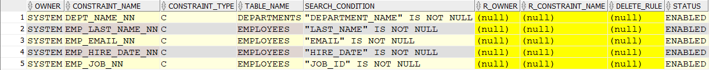

# 3. Data Definition Language (DDL)

## Index
1. [Overview](#overview)
2. [CREATE](#create)
   - [Create Table](#create-table)
   - [Describe Departments Table](#describe-departments-table)
   - [Describe Employees Table](#describe-employees-table)
3. [ALTER](#alter)
   - [Dropping Existing Inline Constraints](#dropping-existing-inline-constraints)
   - [Adding Constraints Out-of-line](#adding-constraints-out-of-line)
   - [Adding a New Column](#adding-a-new-column)
   - [Modifying an Existing Column](#modifying-an-existing-column)
   - [Renaming an Existing Column](#renaming-an-existing-column)
   - [Deleting an Existing Column](#deleting-an-existing-column)
4. [TRUNCATE](#truncate)
5. [RENAME](#rename)
6. [DROP](#drop)

---

## Overview

DDL statements are used to define or modify the database objects such as tables, views, etc.  
All DDL statements are auto-committed, which means the changes become permanent once executed.

Commonly used DDL statements are:
- CREATE
- ALTER
- DROP
- RENAME
- TRUNCATE

## CREATE

Below is the script to create Employees and Departments tables (**HR Schema**) along with constraints (**inline specification**):

### Create Table

```sql
CREATE TABLE departments
    ( department_id    NUMBER(4) 
    , department_name  VARCHAR2(30)  CONSTRAINT  dept_name_nn  NOT NULL
    , manager_id       NUMBER(6)
    , location_id      NUMBER(4)
    , CONSTRAINT dept_id_pk  		 PRIMARY KEY (department_id)
    ) ;


CREATE TABLE employees
    ( employee_id    NUMBER(6)
    , first_name     VARCHAR2(20)
    , last_name      VARCHAR2(25)	CONSTRAINT     emp_last_name_nn  NOT NULL
    , email          VARCHAR2(25)	CONSTRAINT     emp_email_nn  NOT NULL
    , phone_number   VARCHAR2(20)
    , hire_date      DATE	        CONSTRAINT     emp_hire_date_nn  NOT NULL
    , job_id         VARCHAR2(10)	CONSTRAINT     emp_job_nn  NOT NULL
    , salary         NUMBER(8,2)
    , commission_pct NUMBER(2,2)
    , manager_id     NUMBER(6)
    , department_id  NUMBER(4)
    , CONSTRAINT     emp_salary_min    CHECK (salary > 0) 
    , CONSTRAINT     emp_email_uk      UNIQUE (email)
    , CONSTRAINT     emp_emp_id_pk     PRIMARY KEY (employee_id)
    , CONSTRAINT     emp_dept_fk       FOREIGN KEY (department_id) REFERENCES departments
    ) ;
```

### Describe Departments Table

```sql
DESC departments
```

| Name            | Null?     | Type         |
|-----------------|-----------|--------------|
| DEPARTMENT_ID   | NOT NULL  | NUMBER(4)    |
| DEPARTMENT_NAME | NOT NULL  | VARCHAR2(30) |
| MANAGER_ID      |           | NUMBER(6)    |
| LOCATION_ID     |           | NUMBER(4)    |

### Describe Employees Table

```sql
DESC employees
```

| Name            | Null?     | Type         |
|-----------------|-----------|--------------|
| EMPLOYEE_ID     | NOT NULL  | NUMBER(6)    |
| FIRST_NAME      |           | VARCHAR2(20) |
| LAST_NAME       | NOT NULL  | VARCHAR2(25) |
| EMAIL           | NOT NULL  | VARCHAR2(25) |
| PHONE_NUMBER    |           | VARCHAR2(20) |
| HIRE_DATE       | NOT NULL  | DATE         |
| JOB_ID          | NOT NULL  | VARCHAR2(10) |
| SALARY          |           | NUMBER(8,2)  |
| COMMISSION_PCT  |           | NUMBER(2,2)  |
| MANAGER_ID      |           | NUMBER(6)    |
| DEPARTMENT_ID   |           | NUMBER(4)    |

```sql
SELECT * FROM 
user_constraints
WHERE 1=1
AND table_name IN ('EMPLOYEES', 'DEPARTMENTS');
```


## ALTER

The ALTER command can be used to modify existing database objects. In this section, we'll drop the existing **inline** specified constraints on Employees and Departments tables and re-create them using **out-of-line specification**.

### Dropping Existing Inline Constraints

```sql
ALTER TABLE employees DROP CONSTRAINT EMP_DEPT_FK;
ALTER TABLE departments DROP CONSTRAINT DEPT_ID_PK;
ALTER TABLE employees DROP CONSTRAINT EMP_SALARY_MIN;
ALTER TABLE employees DROP CONSTRAINT EMP_EMP_ID_PK;
ALTER TABLE employees DROP CONSTRAINT EMP_EMAIL_UK;
```

> **Note:** Foreign key columns in the child table cannot have values that are not present in the corresponding primary key column. When an SQL operation (insert, delete, or update) attempts to change data in a way that compromises this rule, a referential constraint violation occurs.

```sql
SELECT * FROM 
user_constraints
WHERE 1=1
AND table_name IN ('EMPLOYEES', 'DEPARTMENTS');
```



> **Important:** Dropping constraint **DEPT_ID_PK** before dropping **EMP_DEPT_FK** will throw the following exception:
```sql
Error report -
ORA-02273: this unique/primary key is referenced by some foreign keys
02273. 00000 -  "this unique/primary key is referenced by some foreign keys"
*Cause:    Self-evident.
*Action:   Remove all references to the key before the key is to be dropped.
```

### Adding Constraints Out-of-line

```sql
ALTER TABLE departments ADD CONSTRAINT dept_id_pk PRIMARY KEY (department_id);
ALTER TABLE employees ADD ( CONSTRAINT emp_emp_id_pk PRIMARY KEY (employee_id)
                          , CONSTRAINT emp_dept_fk FOREIGN KEY (department_id) REFERENCES departments
                          , CONSTRAINT emp_salary_min CHECK (salary > 0) 
                          , CONSTRAINT emp_email_uk UNIQUE (email) );
```

```sql
SELECT * FROM 
user_constraints
WHERE 1=1
AND table_name IN ('EMPLOYEES', 'DEPARTMENTS');
```


### Adding a New Column

```sql
ALTER TABLE departments ADD test VARCHAR2(2);
DESC departments;
```

| Name            | Null?     | Type         |
|-----------------|-----------|--------------|
| DEPARTMENT_ID   | NOT NULL  | NUMBER(4)    |
| DEPARTMENT_NAME | NOT NULL  | VARCHAR2(30) |
| MANAGER_ID      |           | NUMBER(6)    |
| LOCATION_ID     |           | NUMBER(4)    |
| TEST            |           | VARCHAR2(2)  |

### Modifying an Existing Column

```sql
ALTER TABLE departments MODIFY test NUMBER(2);
DESC departments;
```

| Name            | Null?     | Type         |
|-----------------|-----------|--------------|
| DEPARTMENT_ID   | NOT NULL  | NUMBER(4)    |
| DEPARTMENT_NAME | NOT NULL  | VARCHAR2(30) |
| MANAGER_ID      |           | NUMBER(6)    |
| LOCATION_ID     |           | NUMBER(4)    |
| TEST            |           | NUMBER(2)    |

### Renaming an Existing Column

```sql
ALTER TABLE departments RENAME COLUMN test TO test2;
DESC departments;
```

| Name            | Null?     | Type         |
|-----------------|-----------|--------------|
| DEPARTMENT_ID   | NOT NULL  | NUMBER(4)    |
| DEPARTMENT_NAME | NOT NULL  | VARCHAR2(30) |
| MANAGER_ID      |           | NUMBER(6)    |
| LOCATION_ID     |           | NUMBER(4)    |
| TEST2           |           | NUMBER(2)    |

### Deleting an Existing Column

```sql
ALTER TABLE departments DROP COLUMN test2;
DESC departments;
```

| Name            | Null?     | Type         |
|-----------------|-----------|--------------|
| DEPARTMENT_ID   | NOT NULL  | NUMBER(4)    |
| DEPARTMENT_NAME | NOT NULL  | VARCHAR2(30) |
| MANAGER_ID      |           | NUMBER(6)    |
| LOCATION_ID     |           | NUMBER(4)    |

## TRUNCATE

Let us create a demo table to demonstrate Truncate usage.

```sql
CREATE TABLE demo AS 
SELECT '1' AS column1, '2' AS column2 FROM dual
UNION
SELECT '10', '20' FROM dual
UNION
SELECT '100', '200' FROM dual
UNION
SELECT '1000', '2000' FROM dual
UNION
SELECT '10000', '20000' FROM dual
UNION
SELECT '100000', '200000' FROM dual
;

SELECT * FROM 
demo ;
```

| COLUMN1 | COLUMN2 |
|---------|---------|
| 1       | 2       |
| 10      | 20      |
| 100     | 200     |
| 1000    | 2000    |
| 10000   | 20000   |
| 100000  | 200000  |

```sql
TRUNCATE TABLE demo;

SELECT COUNT(*) FROM 
demo;
``

`

> **Note:** The above query gives 0 as output. Truncate removes all the rows from a table and deallocates the space used by the removed rows. This does not remove the table structure from the database.

## RENAME

```sql
RENAME demo TO demo_rename;
DESC demo_rename;
```

| Name    | Null? | Type        |
|---------|-------|-------------|
| COLUMN1 |       | VARCHAR2(6) |
| COLUMN2 |       | VARCHAR2(6) |

> **Note:** Applying **DESC** on the **demo** table will throw the following error:

```sql
ERROR:
ORA-04043: object demo does not exist 
```

## DROP

```sql
DROP TABLE demo_rename;
```

> **Note:** Applying **DESC** on the **demo_rename** table will throw the following error:

```sql
ERROR:
ORA-04043: object demo_rename does not exist 
```

---

> #### [Gist File Link](https://gist.github.com/venkatdurgempudi/c39596da09994bc08a675e31b22f7026)

---
