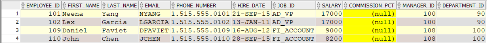
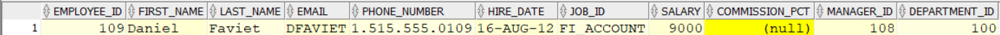
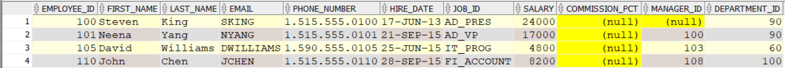
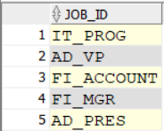
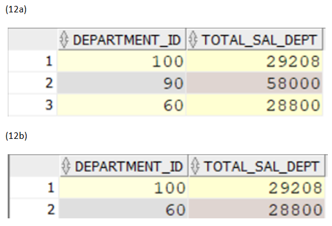

# 6. Data Retrieval Language (SELECT)

- The `SELECT` statement is used to retrieve data from one or more tables.
- Using the `SELECT` statement, the following operations can be performed:
  
  - **Projection**: Displays a subset of columns.
  - **Selection**: Displays a subset of rows.

## Index

1. [Basic SELECT](#1-basic-select)
2. [Projection: Selecting Specific Columns](#projection-selecting-specific-columns)
3. [Selection: Restricting Rows with Conditions](#selection-restricting-rows-with-conditions)
4. [Restricting Selection Using IN Keyword](#restricting-selection-using-in-keyword)
5. [Pattern Matching](#pattern-matching)
6. [Range Checking with BETWEEN](#range-checking-with-between)
7. [Handling NULL Values](#handling-null-values)
8. [String Concatenation](#string-concatenation)
9. [Using Column Aliases](#using-column-aliases)
10. [Removing Duplicates with DISTINCT](#removing-duplicates-with-distinct)
11. [Sorting Results with ORDER BY](#sorting-results-with-order-by)
12. [Grouping Results with GROUP BY](#grouping-results-with-group-by)

## Basic Query Examples

### (1) Basic SELECT

To display all records from the table:

```sql
SELECT * FROM employees;
```


### (2) Projection: Selecting Specific Columns

To retrieve specific columns:

```sql
SELECT EMPLOYEE_ID, FIRST_NAME, LAST_NAME FROM employees;
```


### (3) Selection: Restricting Rows with Conditions

Using comparison operators:

```sql
-- (3a) Display records where Manager Id is 103
SELECT * FROM employees WHERE MANAGER_ID = 103;

-- (3b) Display records where Manager Id is 103 and Salary > 5000
SELECT * FROM employees WHERE MANAGER_ID = 103 AND SALARY > 5000;
```


### (4) Restricting Selection Using IN Keyword

```sql
-- Display records where Job Id is either FI_ACCOUNT or AD_VP
SELECT * FROM employees WHERE JOB_ID IN ('FI_ACCOUNT', 'AD_VP');
```



### (5) Pattern Matching

Using `LIKE` for pattern matching:

```sql
-- Display records where First Name starts with 'D' and the last but one letter is 'e'
SELECT * FROM employees WHERE FIRST_NAME LIKE 'D%e_';
```



### (6) Range Checking with BETWEEN

```sql
-- Display records hired between 1st Jan 2013 and 31st Dec 2015
SELECT * FROM employees WHERE HIRE_DATE BETWEEN '01-JAN-13' AND '31-DEC-15';
```



### (7) Handling NULL Values

```sql
-- (7a) Display records where Manager Id is NULL
SELECT * FROM employees WHERE MANAGER_ID IS NULL;

-- (7b) Display records where Manager Id is NOT NULL
SELECT * FROM employees WHERE MANAGER_ID IS NOT NULL;
```


### (8) String Concatenation

```sql
-- Concatenate strings with table values
SELECT 'The salary of ' || FIRST_NAME || ' ' || LAST_NAME || ' is: ' || SALARY FROM employees;
```


### (9) Using Column Aliases

```sql
-- Use aliases for column headings
SELECT EMPLOYEE_ID AS Id, SALARY AS Earnings FROM employees;
```


### (10) Removing Duplicates with DISTINCT

```sql
-- Display distinct Job Id values
SELECT DISTINCT JOB_ID FROM employees;
```



### (11) Sorting Results with ORDER BY

```sql
-- (11a) Display records in ascending order of Salary
SELECT * FROM employees ORDER BY SALARY;

-- (11b) Display records in descending order of Salary
SELECT * FROM employees ORDER BY SALARY DESC;
```


### (12) Grouping Results with GROUP BY

```sql
-- (12a) Group results by Department Id and sum salaries
SELECT DEPARTMENT_ID, SUM(SALARY) AS Total_Sal_Dept FROM employees GROUP BY DEPARTMENT_ID;

-- (12b) Filter grouped data using HAVING
SELECT DEPARTMENT_ID, SUM(SALARY) AS Total_Sal_Dept FROM employees GROUP BY DEPARTMENT_ID HAVING SUM(SALARY) < 30000;
```


```
